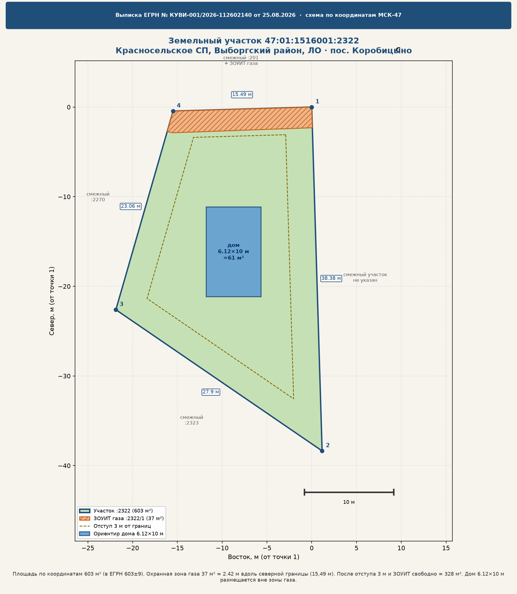

# Выписка ЕГРН: участок 47:01:1516001:2322

Разбор выписки с ЕПГУ от 20.08.2026 (документ Роскадастра № КУВИ-001/2026-112602140 от 25.08.2026). Исходный PDF — `source/vyipiska_EGRN_47-01-1516001-2322.pdf`. Схема по координатам — `schema_uchastka.png`.

## Короткий вывод

Участок **пригоден под ИЖС**. Право собственности зарегистрировано, арестов и ипотеки в реестре прав нет, границы с координатами есть, категория и ВРИ — строительство индивидуального жилого дома.

Есть одно существенное ограничение: **охранная зона газораспределительных сетей** на части участка **38 м²** (около 6% площади). Это не ипотека и не сервитут в разделе прав, но ЗОУИТ уже внесена в кадастр и действует по ст. 56 ЗК РФ. Капитальный дом, сарай, погреб, деревья и глубокая копка в этой полосе **нельзя**. Полоса узкая: примерно **2,4 м** вдоль северной границы (15,49 м). Дом 6,12×10 м из сметы отделки на свободной части размещается.

На участке числится объект недвижимости **47:01:1516001:2437**. По этой выписке его вид не раскрыт — нужна отдельная выписка (вероятнее всего дом или линейный объект у северной границы).

## Реквизиты

| Поле | Значение |
| --- | --- |
| Документ | Выписка из ЕГРН об объекте недвижимости |
| Кем выдана | Филиал ППК «Роскадастр» по Ленинградской области |
| Номер / дата | КУВИ-001/2026-112602140, 25.08.2026 |
| Запрос | 20.08.2026, ЕПГУ |
| Объём | 11 листов, 8 разделов |
| Получатель | Илемская Яна Ивановна |
| Статус записи | актуальные |

## Участок

| Поле | Значение |
| --- | --- |
| Кадастровый номер | **47:01:1516001:2322** |
| Квартал | 47:01:1516001 |
| Дата присвоения номера | 13.02.2024 |
| Адрес в ЕГРН | РФ, Ленинградская область, Выборгский район, Красносельское сельское поселение |
| Фактическая привязка | кадастровый квартал и ЗОУИТ «газопроводы-вводы по пос. Коробицыно (2-й этап)» |
| Площадь | 603 ± 9 м² (по координатам 602,66 м²) |
| Кадастровая стоимость | 771 375,69 ₽ |
| Категория | земли населённых пунктов |
| ВРИ | под строительство индивидуального жилого дома |
| Образован из | 47:01:1516001:2271 |
| Объект в границах участка | **47:01:1516001:2437** |
| Кадастровые работы | Яковлева Д. В., аттестат 2129, договор 31.01.2024, работы 01.02.2024 |

Адрес без улицы и номера — типично для недавно образованного участка. После постановки дома на учёт и присвоения адреса муниципалитетом строка в ЕГРН дополнится.

## Права

- Вид права: **собственность**.
- Номер регистрации: `47:01:1516001:2322-47/050/2024-3`.
- Дата и время: **08.04.2024, 12:04:30**.
- Правообладатель в этой выписке замаскирован (персональные данные).
- Ограничения прав в **разделе 2 не зарегистрированы** (нет ипотеки, аренды, ареста, ренты).
- Договоров ДДУ нет.
- Судебных притязаний, возражений, изъятия, заявлений «в работе» нет.
- Отметки «регистрация только при личном участии» нет.

Юридически это чистый раздел прав. ЗОУИТ живёт отдельно — в кадастре и в особых отметках, а не как обременение в ЕГРН-правах.

## Ограничение: охранная зона газа

Это главный риск по документу.

Часть участка `47:01:1516001:2322/1`, **38 м²**:

- вид: ограничения прав по **ст. 56 ЗК РФ**;
- срок: **не установлен** (бессрочно, пока существует сеть);
- реестр границ: **47:01-6.3779**;
- тип зоны: охранная зона трубопроводов;
- по документу: ЗОУИТ в связи с размещением газораспределительных сетей «Распределительный газопровод и газопроводы-вводы по пос. Коробицыно (2-й этап)»;
- содержание: постановление Правительства РФ от 20.11.2000 **№ 878** (Правила охраны газораспределительных сетей);
- основания: распоряжение Леноблкомимущества **от 23.06.2025 № 1058**, изменения **от 25.05.2026 № 1156**;
- в особых отметках срок действия указан **с 25.06.2026**.

По координатам это узкая полоса вдоль **северной** стороны (точки 4–1, 15,49 м), ширина около **2,4 м**. Так выглядит типичная двухметровая охранная зона газопровода низкого давления, которая заходит на участок с севера (смежный `:201`).

### Что нельзя в этой полосе 38 м²

По Правилам № 878 в охранной зоне газораспределительной сети, в частности:

- строить и реконструировать объекты капитального строительства;
- сносить капитальные объекты без согласования с эксплуатационной организацией;
- сажать деревья и кустарники;
- устраивать свалки, хранить материалы и технику;
- разводить огонь;
- копать глубже 0,3 м (на пашне — 0,45 м) без разрешения владельца сети;
- перекрывать подъезды к сети.

Забор через зону обычно допустим, если оставляют доступ для аварийных служб (калитка / разборная секция). Газон, гравий, плитка без глубокого фундамента — как правило да, после уточнения у газовой организации.

Дом, баня, септик, скважина, погреб, капитальный гараж в эти 38 м² ставить нельзя. На остальные ≈ **565 м²** ограничение ЗОУИТ не распространяется.

## Геометрия

Система координат **МСК-47, зона 1**. СКП точек 0,1 м. Контур — четырёхугольник.

| Сторона | Дирекционный угол | Длина, м | Смежный участок |
| --- | --- | --- | --- |
| 1 → 2 (почти юг) | 178°16,1′ | 38,38 | не указан |
| 2 → 3 (СЗ) | 304°22,1′ | 27,90 | 47:01:1516001:2323 |
| 3 → 4 (ССВ) | 16°5,1′ | 23,06 | 47:01:1516001:2270 |
| 4 → 1 (восток, север участка) | 88°20,1′ | 15,49 | 47:01:1516001:201 |

Участок вытянут примерно на 38 м с севера на юг. С севера он узкий (15,5 м), к югу шире (~28 м). На плане выписки у соседа `:2270` виден красный контур здания — при посадке дома нужно держать противопожарный разрыв, не только трёхметровый отступ.

Схема по координатам (север вверх):

Пересчёт: `python3 egrn/generate_schema.py`.

## Объект 47:01:1516001:2437

В разделе 1 он указан как объект, расположенный **в пределах** участка. На чертежах выписки контуры `:2437` видны у северной / восточной части (в том числе рядом с красной линией на плане части `:2322/1`).

По одной этой выписке нельзя надёжно сказать, дом это, часть газопровода или иное сооружение. Если каркас 6,12×10 м уже стоит — с высокой вероятностью это он. Чтобы закрыть вопрос, нужна **отдельная выписка ЕГРН на 47:01:1516001:2437**.

## Дом 6,12×10 м и посуточная сдача

Исходные размеры взяты из сметы внутренней отделки того же проекта.

- Пятно дома ≈ 61 м². Участок 6 соток, после ЗОУИТ свободно ≈ 565 м².
- После отступа 3 м от границ и исключения газовой полосы остаётся порядка **330 м²** контура, куда дом **влезает** (см. `metrics.json`, флаг `house_fits`).
- Сажать дом нужно **южнее** северной полосы. С севера кроме ЗОУИТ ещё смежник `:201` — рабочий отступ 3 м от границы, он чуть строже, чем 2,4 м зоны газа.
- С запада `:2270` (есть здание на плане) — 3 м от границы плюс противопожарный разрыв по деревянному каркасу (часто 8–15 м до чужого дома, уточняется по СП 4.13130 и ПЗЗ).
- Восточная сторона в выписке без смежника: это может быть проезд. Если это красная линия улицы, отступ часто 5 м, не 3. Это уже ПЗЗ Красносельского поселения, не ЕГРН.

По виду разрешённого использования участок — **ИЖС**, не гостиница. Жилой дом с посуточной сдачей как жилья обычно оставляют в рамках жилого назначения. Мини-отель, хостел, отдельные «гостевые номера» как услуга размещения — уже другой вид использования, его на ИЖС, как правило, нет. Имеет смысл:

1. Зарегистрировать дом как жилой дом, получить адрес.
2. Не переводить объект в гостиницу.
3. Уточнить в администрации Красносельского СП / Выборгского района, нет ли местных ограничений на посуточную аренду.

Коробицыно — зона горнолыжных курортов, спрос на посуточную здесь очевидный; это не отменяет ВРИ.

## Чего в выписке нет (и это хорошо)

Нет ООПТ, ОЭЗ, резервирования, земельного спора, проекта межевания, результатов надзора, отметки об изъятии. Леса и водные объекты в границах участка не значатся.

## Что сделать дальше

1. Заказать выписку ЕГРН на **47:01:1516001:2437**.
2. Взять градостроительный план / выписку из ПЗЗ и проверить отступы, красные линии, высотность.
3. Запросить в газовой организации схему сети и письменные условия по охранной зоне 47:01-6.3779 (можно ли забор, въезд, септик за пределами 38 м²).
4. Не ставить фундамент, септик и посадки в полосу `:2322/1`.
5. Перед строительством или достройкой — уведомление о строительстве в орган местного самоуправления (ИЖС).
6. После дома — технический план, учёт, адрес, затем уже посуточная как жильё.

Это разбор конкретной выписки, не юридическое заключение и не замена ГПЗУ / ТУ газовой службы.
